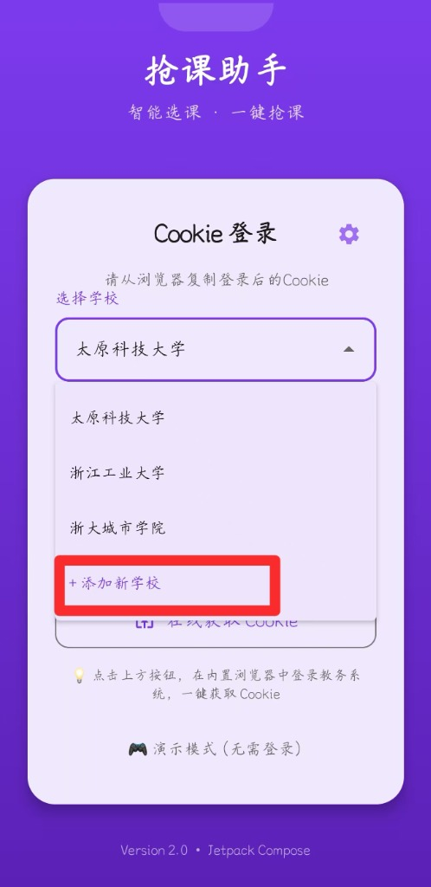
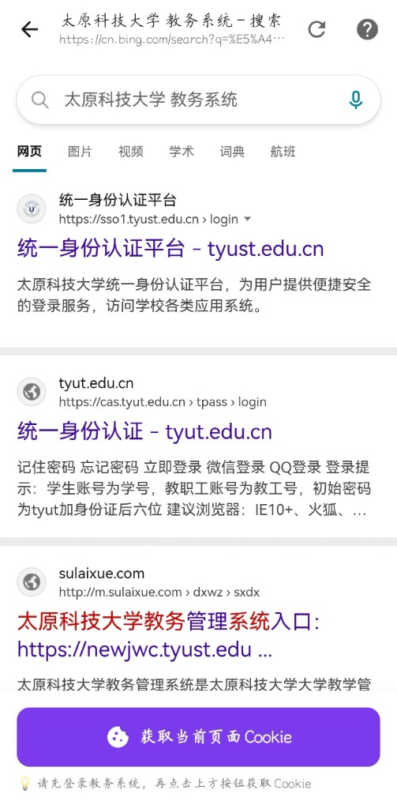
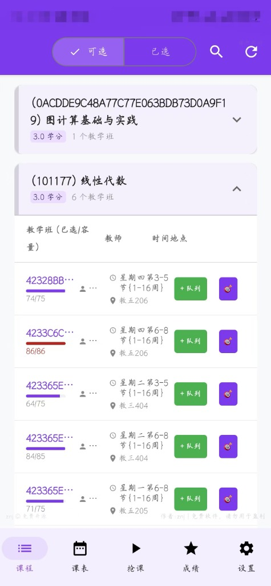
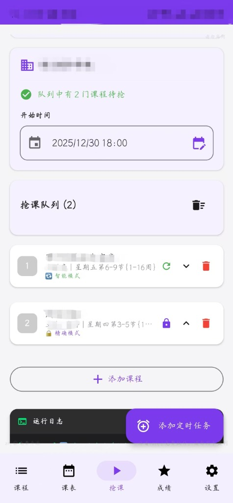
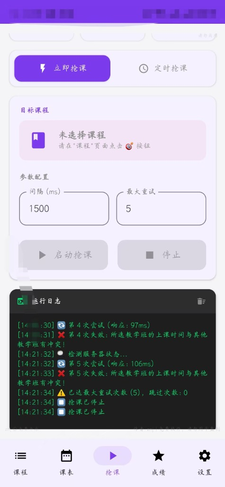
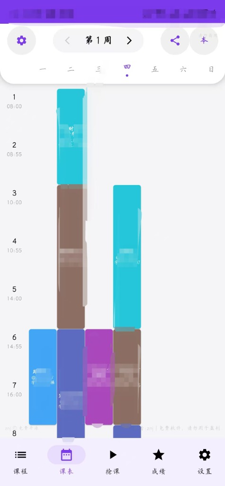
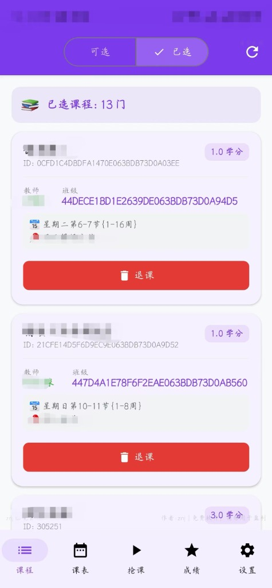
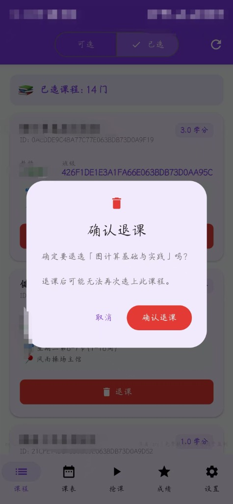
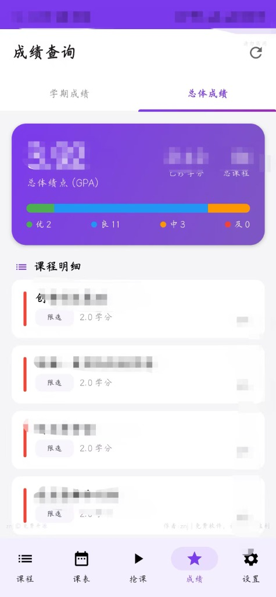

# 正方教务助手 (Android)

一款针对正方教务系统的 Android 客户端，支持课程查询、智能抢课、课表查看、成绩查询等功能。采用现代化 UI 设计，操作流畅，功能完善。

---

## 功能介绍

### 1. 登录与认证

应用采用 Cookie 认证方式，无需在 App 内输入密码，保障账号安全。

**使用流程：**
1. 在手机浏览器中登录教务系统
2. 复制浏览器中的 Cookie
3. 粘贴到 App 中完成登录

**特性：**
- 支持多所学校的正方教务系统
- Cookie 本地加密存储
- 支持自动登录（保存登录状态）
- 登录失效时自动提示重新配置





---

### 2. 课程列表

查看当前学期所有可选课程，快速定位目标课程。

**功能点：**
- 按课程名称关键词搜索
- 按课程类别筛选（通识课、专业课等）
- 显示课程余量、上课时间、授课教师
- 点击课程可查看详情或直接选课



---

### 3. 智能抢课

核心功能模块，提供多种抢课策略应对不同场景。

#### 3.1 定时抢课

设置指定日期和时间，到点自动开始抢课。适用于选课系统开放前的预约场景。

**配置项：**
- 开始日期/时间
- 抢课间隔（毫秒级）
- 最大重试次数
- 多课程队列（按顺序依次尝试）



#### 3.2 立即抢课

实时监控目标课程状态，检测到有空位时立即提交选课请求。

**工作原理：**
1. 持续轮询课程接口获取最新余量
2. 余量 > 0 时立即发送选课请求
3. 选课成功后自动停止监控



#### 3.3 捡漏模式

针对已满课程的持续监控，当有学生退课时第一时间抢入。

**适用场景：**
- 热门课程已被选满
- 等待其他同学退课
- 长时间挂机等待

---

### 4. 课表查看

清晰直观的周课表视图，一目了然地查看每周课程安排。

**功能点：**
- 按周次切换查看
- 显示课程名称、教室、节次
- 不同课程自动分配颜色
- 支持导出为 iCalendar (.ics) 格式
- 可同步至手机系统日历



---

### 5. 已选课程管理

管理当前学期已选的所有课程。

**功能点：**
- 查看已选课程列表
- 显示课程学分、课时
- 一键退课功能
- 退课前二次确认，防止误操作





---

### 6. 成绩查询

查询历史各学期成绩，了解学业情况。

**功能点：**
- 按学期筛选成绩
- 显示课程成绩、学分、绩点
- 自动计算学期平均绩点
- 支持查看成绩详情



---

### 7. 设置与账号管理

**设置项：**
- 学校切换
- Cookie 重新配置
- 清除本地缓存
- 检查更新
- 关于/版本信息

**账号配额管理：**
- 查看当前设备绑定的学生账号
- 显示配额使用情况（如 1/3）
- 超级用户标识

---

## 技术实现

| 模块 | 技术选型 |
|------|----------|
| 开发语言 | Kotlin + Java |
| UI 框架 | Jetpack Compose + 传统 View 混合 |
| 网络请求 | OkHttp |
| 异步处理 | Kotlin Coroutines |
| 数据存储 | SharedPreferences |
| HTML 解析 | Jsoup |
| JSON 解析 | org.json |

---

## 构建说明

### 环境要求

- Android Studio Hedgehog 或更高版本
- JDK 17
- Android SDK 34

### 构建步骤

```bash
# 克隆项目
git clone https://github.com/znjhahaha/zhengfang-apk.git

# 进入项目目录
cd zhengfang-apk

# 构建 Debug 版本
./gradlew assembleDebug

# 构建 Release 版本（需配置签名）
./gradlew assembleRelease
```

### 签名配置

Release 构建需要配置签名密钥，在 `app/` 目录下创建 `release-key.jks` 并在 `build.gradle` 中配置签名信息。

---

## 项目结构

```
app/src/main/java/com/tyust/course/
├── activation/          # 激活与设备管理
│   └── ActivationManager.kt
├── fragment/            # Fragment 页面
│   ├── GradesFragment.kt
│   ├── GrabProFragment.kt
│   ├── ScheduleFragment.kt
│   └── SettingsFragment.kt
├── manager/             # 业务管理器
│   ├── SmartSelector.java
│   ├── StudentLimitManager.kt
│   └── UserManager.java
├── model/               # 数据模型
│   ├── Course.java
│   └── SchoolConfig.java
├── network/             # 网络请求
│   └── CourseApiClient.java
├── ui/                  # Compose UI
│   ├── route/           # 页面路由
│   ├── screen/          # 页面组件
│   └── theme/           # 主题配置
└── utils/               # 工具类
    ├── CourseParser.java
    ├── DeviceUtils.kt
    └── ICalExporter.kt
```

---

## 免责声明

本项目仅供学习交流使用，请勿用于任何商业用途。使用本软件所产生的一切后果由用户自行承担。

---

## 许可证

Apache License 2.0
