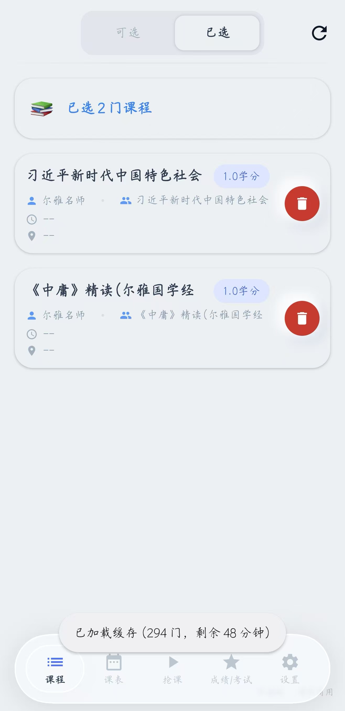
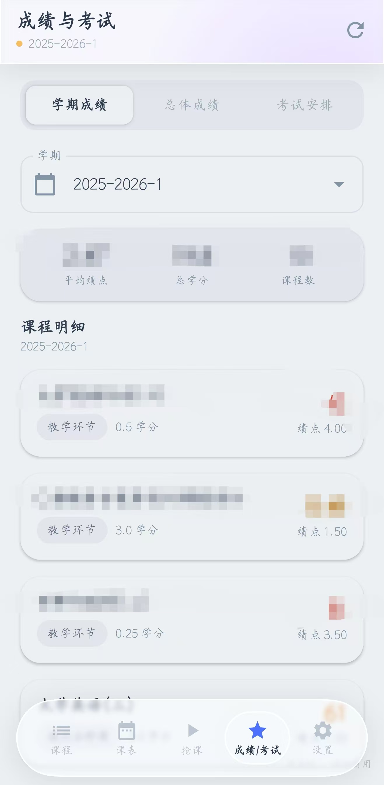
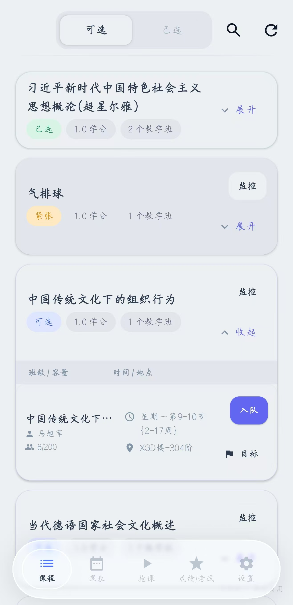
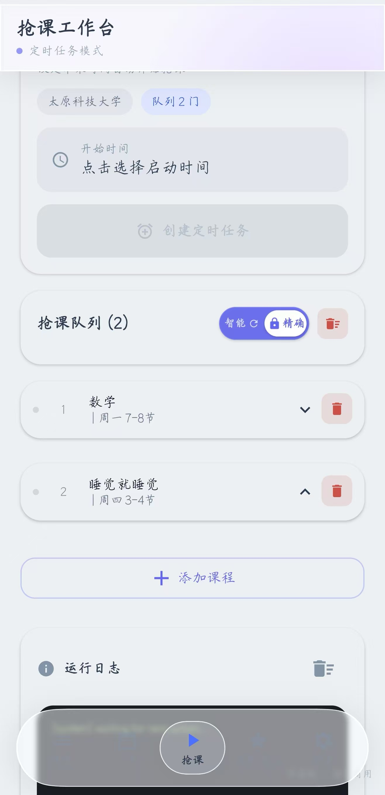
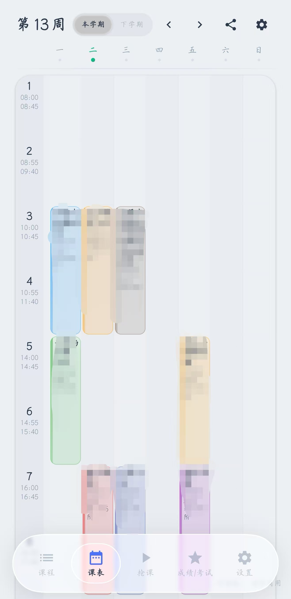
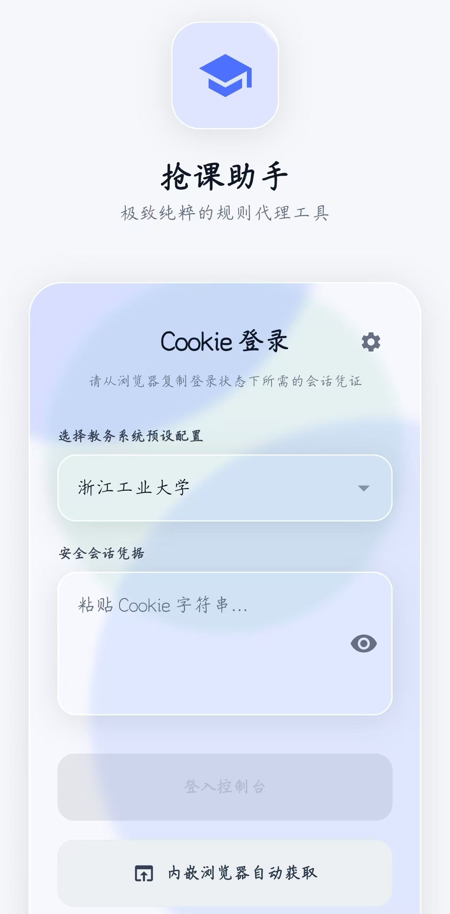
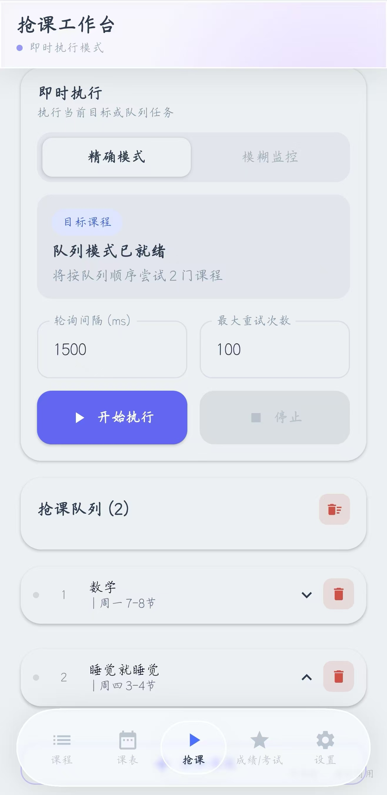
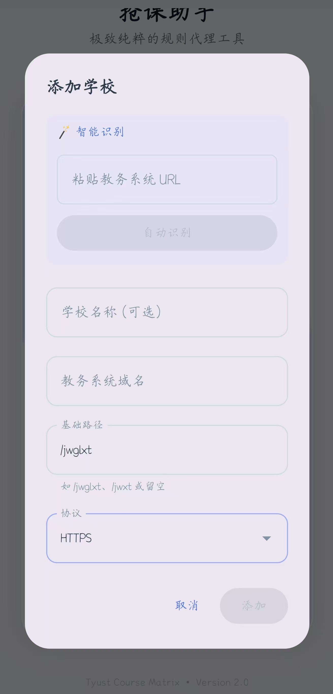
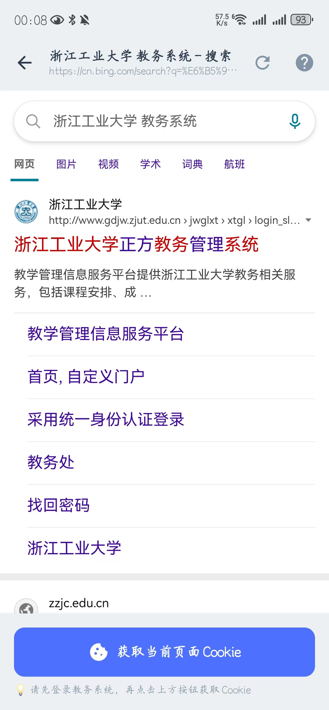
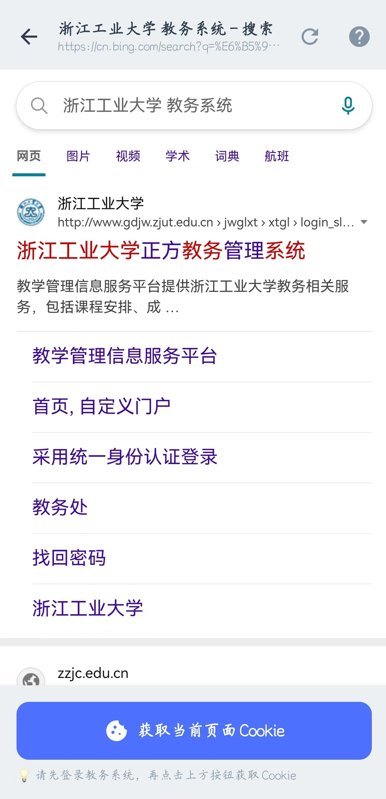

<p align="center">
  
  
  
  
</p>

<h1 align="center">正方教务助手</h1>

<p align="center">
  <strong>开源 · 免费 · 安全</strong><br/>
  一个跑在 Android 上的正方教务系统选课客户端<br/>
  这版把 UI 重写了，用的 iOS 26 液体玻璃
</p>

<p align="center">
  <a href="https://github.com/znjhahaha/zhengfang-apk/releases/latest"></a>
  <a href="https://github.com/znjhahaha/zhengfang-apk/actions"></a>
  <a href="LICENSE"></a>
  <a href="https://github.com/znjhahaha/zhengfang-apk/stargazers"></a>
</p>

---

## 关于这次重写

这版把整个客户端 UI 从 Material 默认风格换成了 iOS 26 那套 Liquid Glass，底用的 Jetpack Compose + Kyant Backdrop 2.0 做真实折射渲染。

- **液体玻璃**：`blur + lens + vibrancy` 三件套，折射和色散都是算出来的
- **动态壁纸**：蓝/紫/青三个渐变模糊球做底图，玻璃组件实时折射出光斑
- **双层 Backdrop**：底栏和卡片各自独立渲染，互相不搭界，大屏也跑得动
- **压感高光**：按下玻璃表面会有跟随手指的高光，手感接近 iOS 控制中心
- **胶囊底栏**：玻璃胶囊包着 5 个 Tab，选中态镜片凸起 + 弹簧缩放
- **状态栏透明**：内容直接透到壁纸层
- **Lottie 启动动画**：登录页用 Lottie JSON 渲染
- **动效统一**：spring/tween 曲线全收在 `MotionTokens` 里，转场逻辑统一

老设备跑不动硬件 backdrop 的话，会自动回退到软阴影。

---

## 功能

- 课程浏览：按关键词搜、按类别筛，显示余量和教师
- 抢课三种模式：立即抢课（手快有）、定时抢课（设好时间到点发包）、捡漏（盯着满员课等退课）
- 课表：周视图，课程自动配色，可导出 `.ics` 同步到系统日历
- 成绩：按学期查，GPA 自动算
- 多校适配：内置一些学校配置，不在列表里的可以自己加
- 应用内更新：启动检测新版，进度条下载完直接装
- 公告 / 反馈：公告有时间线，反馈直接发到作者邮箱
- 设备激活：按设备管配额，防止被当脚本工具刷

App 不收你密码，登录用 Cookie 临时凭证，过期了 App 会提醒重新拉一次。

---

## 截图

<table>
  <tr>
    <td align="center"><br/><sub>玻璃胶囊底栏</sub></td>
    <td align="center"><br/><sub>课程列表</sub></td>
    <td align="center"><br/><sub>周视图课表</sub></td>
    <td align="center"><br/><sub>已选课程</sub></td>
  </tr>
  <tr>
    <td align="center"><br/><sub>立即抢课</sub></td>
    <td align="center"><br/><sub>抢课队列</sub></td>
    <td align="center"><br/><sub>成绩与 GPA</sub></td>
    <td align="center"><br/><sub>设置中心</sub></td>
  </tr>
  <tr>
    <td align="center" colspan="2"><br/><sub>获取 Cookie 教程</sub></td>
    <td align="center" colspan="2"><br/><sub>添加自定义学校</sub></td>
  </tr>
</table>

---

## 快速开始

### 直接下载（推荐）

去 [Releases 页面](https://github.com/znjhahaha/zhengfang-apk/releases/latest) 下载最新 APK，装上就能用。Android 7.0+，建议 Android 12 以上。

### 从源码构建

```bash
git clone https://github.com/znjhahaha/zhengfang-apk.git
cd zhengfang-apk
./gradlew assembleDebug
```

环境要求：Android Studio Hedgehog+、JDK 17、Android SDK 34（`compileSdk 37`）。

---

## 新手教程

### 第一步：登录拿 Cookie

App 内置了浏览器，不需要你手动复制 Cookie：

1. 打开 App，选好学校后进入内置浏览器
2. 浏览器会打开教务系统，正常登录
3. 登录成功后，点底部的「获取 Cookie」按钮
4. Cookie 自动提取并填充，回到主界面就能用了

Cookie 是学校服务器发的临时凭证，过期了 App 会提醒重新走一次。

<p align="center">
  
</p>

### 第二步：选学校

内置列表里有就直接选，没有的话进「添加学校」填教务系统的域名。

<p align="center">
  
</p>

### 第三步：抢课

| 模式 | 啥时候用 | 怎么操作 |
|------|----------|----------|
| 立即抢课 | 有空位，手速要快 | 进课程详情 → 点立即抢课 |
| 定时抢课 | 知道开抢时间 | 设定时间 + 课程 → 到点自动发包 |
| 捡漏模式 | 想抢热门课 | 选好课 → 开捡漏 → 有人退自动顶 |

抢课走 OkHttp + Coroutines，毫秒级发包，失败自动重试。后台靠 Foreground Service + AlarmManager 保活，关屏也能跑。

### 第四步：看课表 / 查成绩

- 课表：底栏第二个 Tab，周视图，右上角可导出 `.ics` 到系统日历
- 成绩：底栏第四个 Tab，按学期查看，GPA 自动算好

---

## 技术栈

Kotlin + Jetpack Compose（Material 3）。液体玻璃用 Kyant Backdrop 2.0，动效 Compose Animation + Lottie，网络 OkHttp + Coroutines，HTML 解析 Jsoup，最低 Android 7.0。打包和发布走 GitHub Actions。

---

## 二次开发

项目基于 **GPLv3** 开源，二开前先把协议看清楚。

> **不接受任何形式的私自打包和分发。** 唯一的二开渠道是向本仓库提 PR，CI/CD 会自动构建并发布——这是为了避免外面满天飞的山寨包。

提 PR 流程：

1. Fork
2. 改完跑一遍 `./gradlew assembleDebug` 确认能编
3. 提交：`git commit -m 'feat: xxx'`
4. 推上去开 PR，CI 会自己跑

UI 类改动记得附真机截图，审起来省事。

---

## 免责声明

- 项目开源免费，仅供学习交流
- 用出任何后果自己负责
- 抢课归抢课，别挂一晚上把学校教务打挂

## 许可证

[GPL-3.0](LICENSE)
https://vsllm.com
