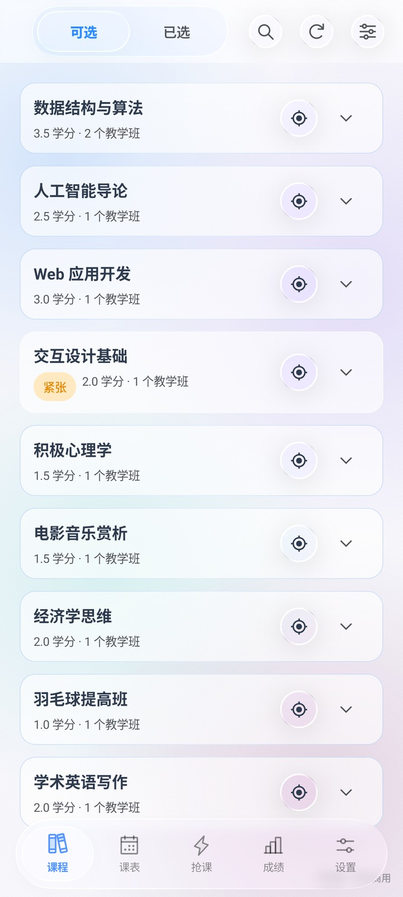
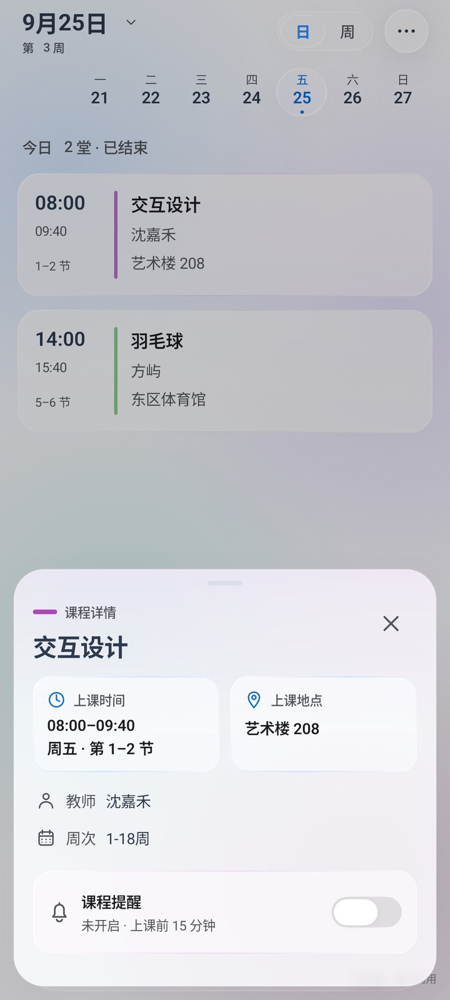
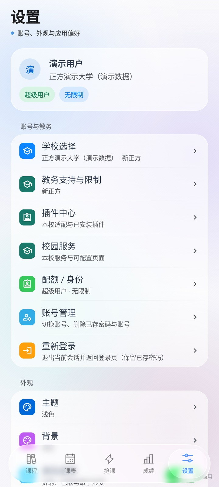
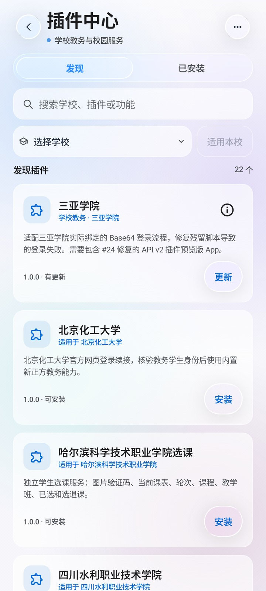
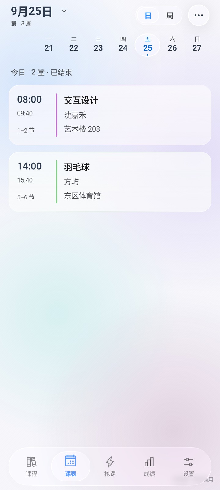
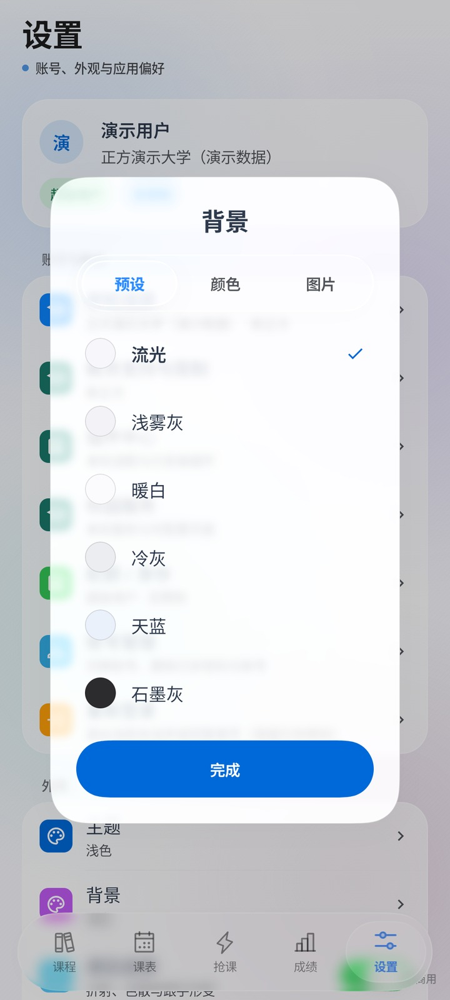

<div align="center">


# 教务助手

在手机上看课表、查成绩、处理选课。

支持新正方、旧正方、新强智和旧强智。金智、乘方提供可供多校复用的通用教务协议，学校差异通过配置或校园插件扩展。

[](https://github.com/znjhahaha/zhengfang-apk/releases/latest)
[](https://github.com/znjhahaha/zhengfang-apk/releases/latest)
[](https://developer.android.com/compose)
[](LICENSE)

**[下载 APK](https://github.com/znjhahaha/zhengfang-apk/releases/latest) · [插件商店](https://plugins.hidisiwa.xyz) · [反馈问题](https://plugins.hidisiwa.xyz/feedback) · [更新记录](CHANGELOG.md)**

[界面预览](#界面预览) · [桌面课表](#桌面课表) · [开始使用](#开始使用) · [校园插件](#校园插件) · [从源码构建](#从源码构建)

</div>

## 界面预览

以下为本机预览留存的真实界面，使用演示课程和本地测试插件，点按图片可查看大图。图片用于展示界面，最新功能以源码说明和对应 [Release](https://github.com/znjhahaha/zhengfang-apk/releases) 为准。

<table>
  <tr>
    <th>一周课程，集中查看</th>
    <th>当天安排，按时间展开</th>
    <th>按学校发现校园插件</th>
  </tr>
  <tr>
    <td><a href="docs/images/schedule-week.png"></a></td>
    <td><a href="docs/images/schedule-day.png"></a></td>
    <td><a href="docs/images/plugin-center.png"></a></td>
  </tr>
</table>

<details>
<summary><strong>液态玻璃界面：导航、详情、设置与背景</strong></summary>

半透明卡片、悬浮导航和背景使用统一材质，支持浅色、深色与自定义图片背景。

| 悬浮导航 | 课程详情 | 分组设置 |
| :---: | :---: | :---: |
|  |  |  |
| 插件中心 | 每日课表 | 背景选择 |
|  |  |  |

这六张图片于 2026-09-25 在本机 MuMu Android 15 截取，版本为 `1.0.87-ui-preview`，均使用演示数据。它们展示既有界面，不作为后续新功能的验收证据；详见 [素材来源](docs/images/liquid-glass/README.md)。

</details>

- **课表先打开，再刷新。** 优先显示本地课程，进入课表后静默更新；切换页面、日期和主题时保留浏览位置。
- **长名称也能看全。** 周／日视图完整显示课程名与教师，点按课程查看详情，长按可复制教室等信息。
- **看课表的方式由你选。** 日／周视图、周末显示、自定义课程、课程提醒，以及日历导出。
- **日期切换保持对齐。** 星期与日期共享列中心和基线；数字滚动支持单／双位变化、跨月与快速反向切换。
- **浅色、深色都可用。** 支持自定义背景和玻璃效果；开关、日期与页面切换提供连续的动画反馈，并适配系统减少动态效果设置。

开关点按与连续切换的实际录屏：

<p align="center"></p>

## 桌面课表

不用打开 App，也能知道下一节上什么、谁来上、去哪里。


| 样式 | 适合怎样使用 | 显示内容 |
| --- | --- | --- |
| **简洁单课 · 1×1** | 桌面只留一小块位置 | 当前或下一节课，完整课名与教师、时间、教室 |
| **双课程 · 2×1** | 提前看下一堂安排 | 两门课并排显示，各自可点按进入详情 |
| **课程时间轴 · 2×2** | 查看当天的连续安排 | 按时间排列，突出当前与下一节，拉大可查看更多课程 |

在 **课表 → 更多 → 桌面组件** 中预览并添加，也可以从桌面的系统小组件列表添加。长按调整尺寸后，文字会更舒展，并可显示结束时间和更多课程。小组件读取当前账号的本地课表，支持离线查看。小尺寸优先为完整课名、教师、时间和教室分配空间，再调整文字大小；不会仅截取教室编号代替完整地点。

## 还能做什么

| 功能 | 内容 |
| --- | --- |
| 课表 | 日／周视图、课程详情、日期切换、日历导出；一次设置所选学期的课前提醒 |
| 成绩与考试 | 按学期查询成绩、绩点和考试安排；以学校提供的数据为准 |
| 选课 | 课程查询、选退课、批量队列、定时执行和余量检测 |
| 校园插件 | 学校搜索、教务适配、原生页面和网页服务；经授权复用本校登录；按版本下载公开源码参与修改 |
| 个性化 | 浅色／深色主题、自定义背景与随设备能力调整的玻璃效果 |
| 消息与反馈 | 更新提示、公告、问卷提醒，以及无需 GitHub 账号的站内反馈 |

具体数据和可用操作由学校系统提供。选课窗口、名额、冲突规则及验证码仍遵循学校要求；定时任务和后台提醒需要相应的系统权限与后台运行条件。

## 开始使用

1. 从 [最新版 Release](https://github.com/znjhahaha/zhengfang-apk/releases/latest) 下载 APK，支持 **Android 7.0 及以上**。
2. 在登录页搜索学校，选择对应适配并确认权限；已有自定义学校可直接选择，也可手动添加或管理学校。按学校要求完成登录。
3. 打开课表并同步课程，检查学期、开学日期和节次时间。随后可以查看成绩、管理选课或添加桌面组件。

应用内可以检查更新。若学校使用特殊登录方式或教务接口，可先在插件中心搜索学校名称。

<details>
<summary><strong>课表、小组件或登录遇到问题？</strong></summary>

- **课程日期不对：** 检查当前学期、开学日期及课程周次；周次不明确的课程会提示核对。
- **小组件没有课程：** 先在 App 中登录并同步课表，再检查节次时间和开学日期。切换账号后，小组件也会切换到对应课表。
- **登录失效：** 返回 App 按提示重新登录；学校要求验证码或额外确认时，需要完成对应步骤。
- **提醒没有出现：** 检查通知权限、系统闹钟权限与后台运行设置。
- **学校暂不支持：** 查看插件商店，或通过反馈入口提供系统类型、教务地址及问题现象。

</details>

## 校园插件

插件中心提供 **发现** 与 **已安装** 两个入口，可以按名称搜索、筛选学校，并查看插件详情、安装或启用适配。已有目录会先显示，刷新失败时仍可浏览本地保存的插件。

学校搜索合并已保存的学校与通过签名验证的插件目录，显示兼容状态和可选提供者。选择适配后按下载校验、权限确认和激活顺序处理，完成后才绑定学校；多个候选由你选择，原有自定义地址会保留。

在插件中心管理本校适配与已安装插件，按学校域名、端口及路径匹配。本校停用、卸载和回滚各有独立入口；离线时仍能使用已有配置及可用缓存。

同一学校可以启用不同作者的功能插件。需要已有教务登录时，由你授权宿主为该插件发送限定范围的请求，插件不会取得密码或 Cookie 原文。插件详情可撤销授权，账号、学校、教务适配或插件版本改变后重新确认；独立认证的服务仍使用各自账号。

作者升级沿用同一个插件 ID 并递增版本，后台按插件归组展示版本历史。功能以独立标签展示和搜索，不混入简介；更新增加权限时须确认，运行中的任务继续使用原版本。

校园服务可使用自身的 `X-Token` 验证，需在清单声明精确网络范围与 `network.request@3`；宿主按请求范围及每次重定向核验。示例见 [服务认证文档](https://plugins.hidisiwa.xyz/docs/SERVICE-AUTH.md)。

插件详情的「本版本源码与参与修改」对应当前安装版本，可查看许可证、源码摘要与仓库入口。下载源码后可以向现维护者提交修复，也可保留原作者与许可证、使用新 ID 独立衍生。历史版本没有公开源码时会明确提示。

**金智、乘方支持多校复用。** 学校适配可以继承通用基础协议，配置本校教务地址、认证入口和网络范围；金智还需要本校作息。接口或登录流程存在差异时，可以用扩展插件补充对应能力。

App 另附湖北汽车工业学院（金智）与山东石油化工学院（乘方）的预置适配，无需额外导入即可使用。其他学校需完成本校配置和兼容验证；乘方基础协议目前不支持选退课提交。具体能力与适配方法见 [六类通用协议与迁移说明](https://plugins.hidisiwa.xyz/docs/architecture-v3/PROTOCOLS.md)。

| 你想做的事 | 入口 |
| --- | --- |
| 找到本校适配、查看作者和兼容要求 | [插件商店](https://plugins.hidisiwa.xyz) |
| 编写教务适配或校园服务插件 | [开发者中心：SDK、模板与接口文档](https://plugins.hidisiwa.xyz/developers) |
| 提交插件问题、查看处理进展 | [站内反馈](https://plugins.hidisiwa.xyz/feedback) |
| 与开发者交流 | **QQ 群：1074017033** |

正式目录中的插件经过审核、验收和签名，旧版插件继续兼容。教务适配按学校域名、端口和路径匹配；发生冲突时可手动选择，本校停用、卸载和回滚各有独立入口。

本仓库保留 App 使用的插件运行时与协议文件，SDK 生成源码和插件网站独立维护。

欢迎有能力的同学为自己的学校开发独立适配，或编写校园服务插件。**开发者 QQ 群：1074017033**。SDK、模板、接口文档和上传入口统一放在 [开发者中心](https://plugins.hidisiwa.xyz/developers)。SDK 3.2.1 保持 API 主版本 3；网站提供“开始开发 → 验证打包 → 提交更新”三步流程。网站源码、使用文档、可复制的 Agent 提示词及两类开发包在 [插件仓库](https://github.com/znjhahaha/zhengfang-plugins) 同步维护。本仓库保留 App 运行时与生成的契约资源。

## 一次设置学期提醒

在课表设置的「课前提醒」中，可一次开启或关闭当前账号、所选学期完整课表的提醒，包含手动课程。已设置的提前时间会保留，新开启的提醒默认提前 15 分钟；之后新加入的课程默认关闭，可以逐门调整。

页面分别显示开启数量和可调度状态。按提示处理通知、精确闹钟权限，以及学期日期和节次时间；缺少时间、已经结束或受到系统限制时，不会把已保存的开关当作通知已经安排。

## 当前源码与 SDK

`main` 包含 SDK 3.2.1 / API 3 对应的宿主能力。现有 Release 保留各自版本信息；新增能力由清单的 `requires` 和 `minAppVersionCode` 检查，不能仅凭 API 主版本相同判断客户端可用。

| 开发入口 | 用途 |
| --- | --- |
| [完整开发套件](https://plugins.hidisiwa.xyz/downloads/plugin-starter-v3.zip) | CLI、SDK、模板、协议源码与离线样本 |
| [独立 SDK 源码包](https://plugins.hidisiwa.xyz/downloads/plugin-sdk-v3.zip) | 类型、契约、生成器和消费示例，可独立重建 |
| [Agent 开发指南](https://plugins.hidisiwa.xyz/docs/AGENT-QUICKSTART.md) | 定位契约、选择模板、验证与交付 |
| [可复制的 Agent 提示词](https://plugins.hidisiwa.xyz/docs/AGENT-PROMPT.md) | 与网站复制按钮同源生成的任务提示词 |
| [使用指南](https://plugins.hidisiwa.xyz/guide) | 安装、授权、更新与源码协作 |

## 反馈与隐私

推荐使用 [站内反馈](https://plugins.hidisiwa.xyz/feedback)，无需 GitHub 账号即可提交问题并查看回复；选择公开提交后会同步 GitHub Issue。App 的设置、插件详情与运行错误页也有反馈入口。

反馈时请附上 **App 版本、学校、操作步骤、预期结果和错误提示**。界面问题可以附截图，记得遮住学号等个人信息；不要公开密码、验证码或会话令牌。

已保存的登录凭据使用 Android Keystore 加密保存在本机，登录时提交到所选学校的教务或认证地址。匿名使用统计可在设置中关闭，统计不包含账号、学校或课程内容。

## 从源码构建

需要 **JDK 17 或以上**、Android SDK Platform **37.0**。使用仓库自带的 Gradle Wrapper，无需 Node.js，也无需单独生成插件 SDK。

```sh
git clone https://github.com/znjhahaha/zhengfang-apk.git
cd zhengfang-apk
./gradlew testDebugUnitTest lintDebug assembleDebug
```

Windows 使用 `gradlew.bat`。通过 `ANDROID_HOME` 或本机 `local.properties` 配置 SDK 路径。调试包输出到 `app/build/outputs/apk/debug/app-debug.apk`。

插件和界面设备测试使用独立的预览包：

```sh
./gradlew assembleUiPreview assembleUiPreviewAndroidTest -PuiTestBuildType=uiPreview
```

预览包包含演示数据，包名为 `com.tyust.course.uipreview`，可以与正式 App 并存。设备回归脚本位于 [`scripts/`](scripts)，支持传入设备序列号、API 级别和 ADB 路径。

<details>
<summary><strong>仓库目录</strong></summary>

```text
app/             Android 应用、插件运行时和测试
docs/images/     README 中使用的界面截图
scripts/         设备回归与发布辅助脚本
release-notes/   各版本发布说明
.github/         GitHub Actions 构建与发布配置
CHANGELOG.md     更新记录
```

</details>

## 参与开发

欢迎提交 [Issue](https://github.com/znjhahaha/zhengfang-apk/issues) 和 Pull Request。涉及学校差异时优先考虑插件；修改 App 时请说明具体问题、修改后的行为及验证方法，界面改动请附截图。

项目采用 [GNU GPL v3](LICENSE)。修改和分发时请保留版权与许可说明，并按要求提供对应源码。
