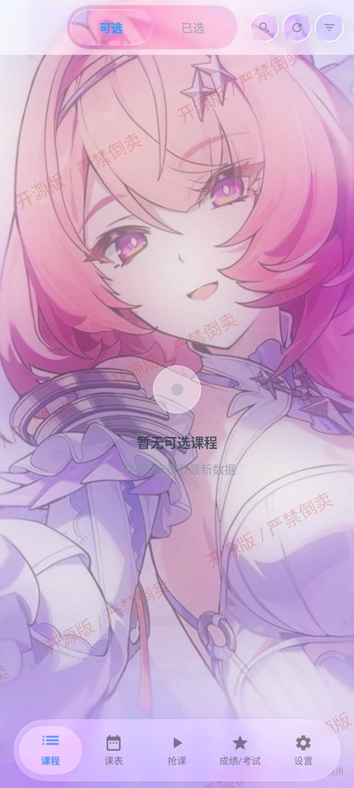
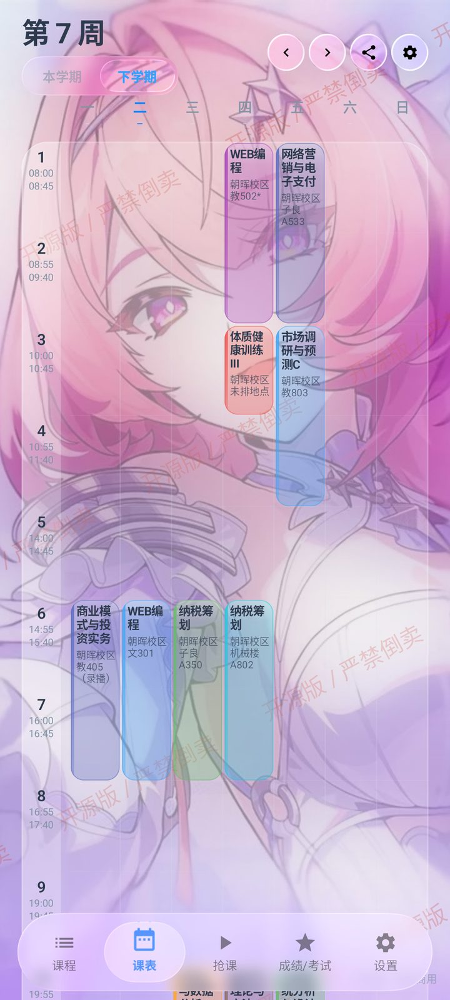
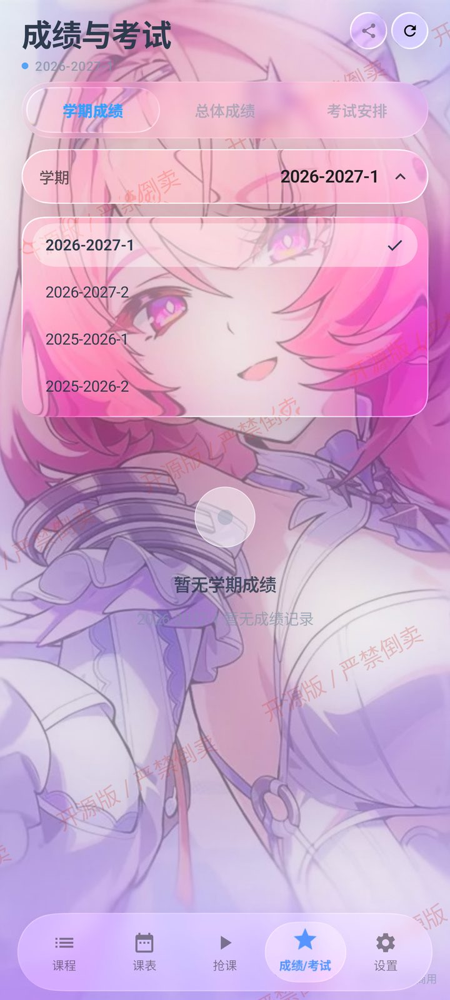
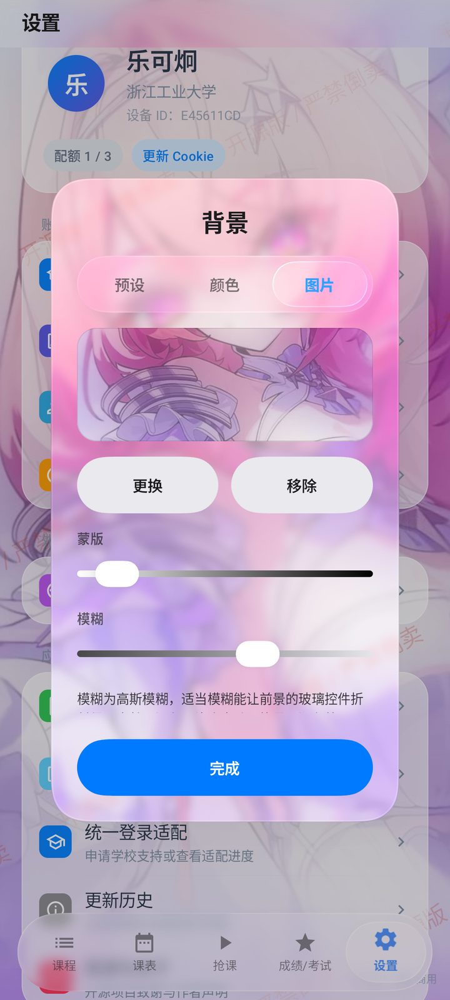
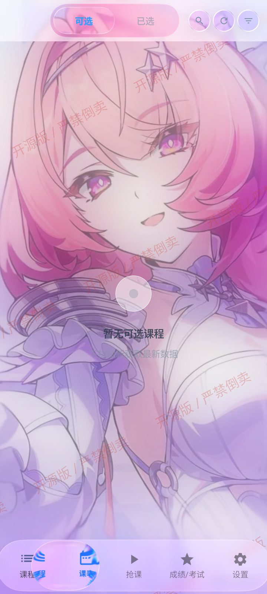
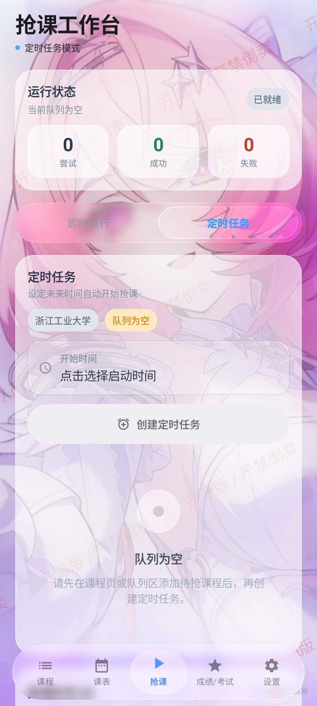
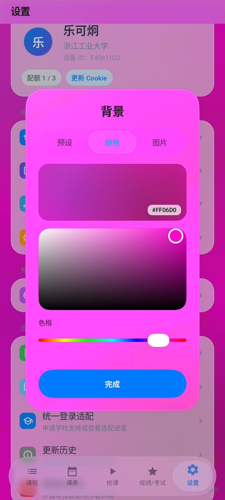
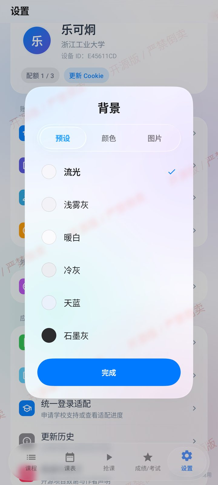

<p align="center">
  
  
  
  
</p>

<h1 align="center">正方教务助手</h1>

<p align="center">
  <strong>开源 · 免费 · 安全</strong><br/>
  一个跑在 Android 上的正方教务系统客户端<br/>
  选课、抢课、课表、成绩，UI 是一整套液态玻璃
</p>

<p align="center">
  <a href="https://github.com/znjhahaha/zhengfang-apk/releases/latest"></a>
  <a href="https://github.com/znjhahaha/zhengfang-apk/actions"></a>
  <a href="LICENSE"></a>
  <a href="https://github.com/znjhahaha/zhengfang-apk/stargazers"></a>
</p>

---

## 这版有什么

界面全套换成了液态玻璃。折射、色散、高光都是实时算的，按下去会形变，松手弹回来，不是贴一层半透明白糊上去。

- **背景可以自己换**：预设渐变、纯色、或者直接用相册里的图
- **图片背景能调**：模糊和蒙版两根滑条，自己拧到舒服为止
- **配色跟着背景走**：浅色底自动配深字，深色底配浅字，不用手动切
- **顶栏随滚动收起**：往下翻的时候一屏能多看一节多的内容
- **筛选改成浮层**：收起来之后列表不会跳回顶部
- **小屏不再被挡**：16:9 这类短屏幕上，弹窗按钮和列表末项以前会被导航栏压住

老设备跑不动实时模糊会自动回退到透镜采样，不会直接卡死。

---

## 功能

选课抢课：

- 按关键词搜、按类别筛，余量和教师都显示
- 即时执行 — 有空位，拼手速
- 定时任务 — 设好开抢时间，到点自动发包
- 捡漏 — 盯着满员的课，有人退立刻顶上

抢课跑在前台服务里，配 AlarmManager 保活，关屏也能继续。

课表成绩：

- 课表周视图，课程自动配色，可导出 `.ics` 到系统日历
- 成绩按学期查，GPA 自动算，另外还有总体成绩和考试安排

杂项：

- 应用内更新，启动检测新版，下载完直接装
- 公告带时间线，反馈直接发作者邮箱
- 设备激活按设备管配额，防止被当成刷课脚本

---

## 支持哪些学校

| 学校 | 登录 |
|------|------|
| 太原科技大学 | 统一身份认证（账号密码） |
| 浙江工业大学 | 统一身份认证（账号密码，会要验证码） |

其他学校的正方协议差得挺多，得一个个适配。App 里「设置 → 统一登录适配」可以提交申请，也能看当前进度。

---

## 密码存哪了

现在是账号密码登录，不用再手动折腾 Cookie 了。

密码走 Android KeyStore 的 AES/GCM 加密，只落在你自己手机上，不传服务器。会话过期 App 会自己续期，不用反复重登。加密或读取失败的话一律当成「没存凭据」处理，不会崩，也不会明文写盘。

不信可以自己翻 `CredentialStore.kt` 和 `SessionRenewer.kt`。

---

## 截图

<table>
  <tr>
    <td align="center"><br/><sub>课程列表</sub></td>
    <td align="center"><br/><sub>底栏切换途中</sub></td>
    <td align="center"><br/><sub>周视图课表</sub></td>
    <td align="center"><br/><sub>抢课工作台</sub></td>
  </tr>
  <tr>
    <td align="center"><br/><sub>成绩与考试</sub></td>
    <td align="center"><br/><sub>图片背景</sub></td>
    <td align="center"><br/><sub>纯色取色</sub></td>
    <td align="center"><br/><sub>预设背景</sub></td>
  </tr>
</table>

第二张是切 Tab 切到一半截的，图标在路上会被拉长然后并到一块，动起来比截图好看。

---

## 快速开始

### 直接下载（推荐）

去 [Releases 页面](https://github.com/znjhahaha/zhengfang-apk/releases/latest) 下载最新 APK，装上就能用。Android 7.0+，建议 12 以上，玻璃效果最全。

### 从源码构建

```bash
git clone https://github.com/znjhahaha/zhengfang-apk.git
cd zhengfang-apk
./gradlew assembleDebug
```

环境要求：Android Studio Hedgehog+、JDK 17、`compileSdk 37` / `targetSdk 34` / `minSdk 24`。

---

## 新手教程

### 第一步：登录

选学校，填教务系统的账号密码。浙江工业大学有时候会要验证码，跟着提示走。

### 第二步：换背景（可选）

设置 → 背景。预设、颜色、图片三个来源，选图片之后能调模糊和蒙版。

<p align="center">
  
  
</p>

### 第三步：抢课

| 模式 | 啥时候用 | 怎么操作 |
|------|----------|----------|
| 即时执行 | 现在就有空位 | 课程详情 → 立即抢课 |
| 定时任务 | 知道几点开抢 | 先把课加进队列 → 设启动时间 → 到点自动跑 |
| 捡漏 | 想抢已经满了的热门课 | 选好课 → 开捡漏 → 有人退自动顶 |

定时任务得先往队列里加课，队列空着创建不了，会提示你。

### 第四步：看课表 / 查成绩

课表在底栏第二个 Tab，周视图，右上角能导出 `.ics`。成绩在第四个，按学期切，GPA 自动算好。

---

## 技术栈

Kotlin + Jetpack Compose（Material 3）。玻璃渲染用 Kyant Backdrop 2.0，`blur + lens + vibrancy` 三层，按设备能力分档，低端机降级到透镜采样。动效走 Compose Animation，spring/tween 曲线全收在 `MotionTokens` 里。网络 OkHttp + Coroutines，HTML 用 Jsoup 解析。屏幕适配靠 `ScreenMetrics` 的两个连续紧凑度系数插值几何，没有尺寸分档。打包发布走 GitHub Actions。

---

## 二次开发

项目基于 **GPLv3** 开源，二开前先把协议看清楚。

> **不接受任何形式的私自打包和分发。** 唯一的二开渠道是向本仓库提 PR，CI/CD 会自动构建并发布——这是为了避免外面满天飞的山寨包。

提 PR 流程：

1. Fork
2. 改完跑一遍 `./gradlew assembleDebug` 确认能编
3. 提交：`git commit -m 'feat: xxx'`
4. 推上去开 PR，CI 会自己跑

UI 类改动记得附真机截图，审起来省事。

更新日志写在 `release-notes/vX.Y.Z.md`，CI 从那儿读，扇到 GitHub Release 和 App 内的更新提示，别到处各写一份。

---

## 免责声明

- 项目开源免费，仅供学习交流
- 用出任何后果自己负责
- 抢课归抢课，别挂一晚上把学校教务打挂

## 许可证

[GPL-3.0](LICENSE)