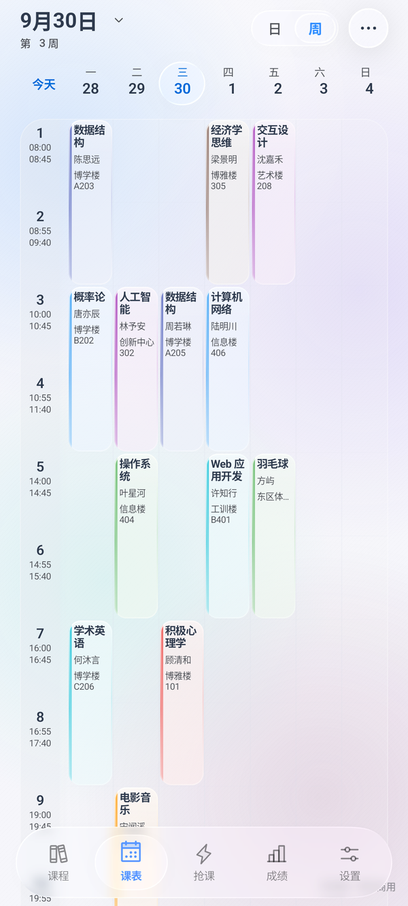
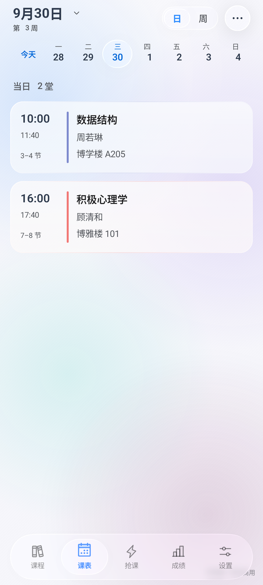
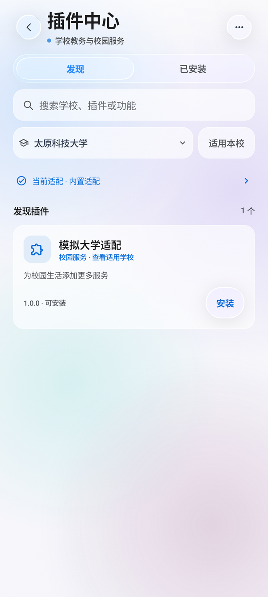
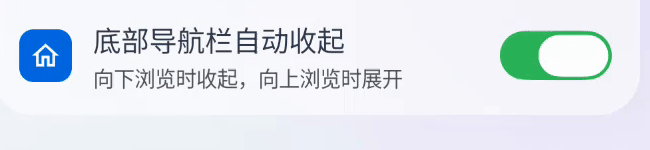
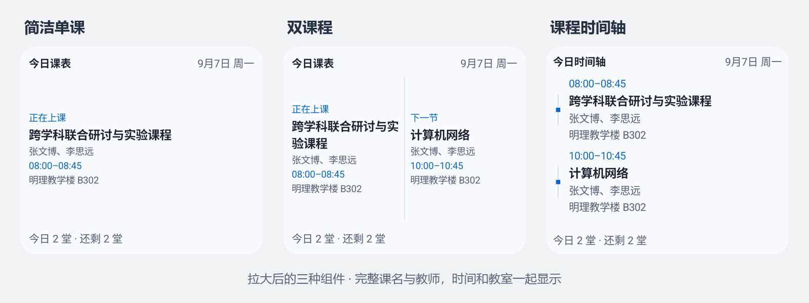

<div align="center">


# 正方教务助手

在手机上看课表、查成绩、处理选课。

支持新正方、旧正方、新强智和旧强智，也可以通过校园插件适配自己的学校。

[](https://github.com/znjhahaha/zhengfang-apk/releases/latest)
[](https://github.com/znjhahaha/zhengfang-apk/releases/latest)
[](https://developer.android.com/compose)
[](LICENSE)

**[下载 APK](https://github.com/znjhahaha/zhengfang-apk/releases/latest) · [插件商店](https://plugins.hidisiwa.xyz) · [反馈问题](https://plugins.hidisiwa.xyz/feedback) · [更新记录](CHANGELOG.md)**

[界面预览](#界面预览) · [桌面课表](#桌面课表) · [开始使用](#开始使用) · [校园插件](#校园插件) · [从源码构建](#从源码构建)

</div>

## 界面预览

以下为当前开发版本的真实界面，使用演示课程和本地测试插件，点按图片可查看大图。发布版本的功能以对应 [Release](https://github.com/znjhahaha/zhengfang-apk/releases) 为准。

<table>
  <tr>
    <th>一周课程，集中查看</th>
    <th>当天安排，按时间展开</th>
    <th>按学校发现校园插件</th>
  </tr>
  <tr>
    <td><a href="docs/images/schedule-week.png"></a></td>
    <td><a href="docs/images/schedule-day.png"></a></td>
    <td><a href="docs/images/plugin-center.png"></a></td>
  </tr>
</table>

- **课表先打开，再刷新。** 优先显示本地课程，进入课表后静默更新；切换页面、日期和主题时保留浏览位置。
- **长名称也能看全。** 周／日视图完整显示课程名与教师，点按课程查看详情，长按可复制教室等信息。
- **看课表的方式由你选。** 日／周视图、周末显示、自定义课程、课程提醒，以及日历导出。
- **浅色、深色都可用。** 支持自定义背景和玻璃效果；开关、日期与页面切换提供连续的动画反馈，并适配系统减少动态效果设置。

开关点按与连续切换的实际录屏：

<p align="center"></p>

## 桌面课表

不用打开 App，也能知道下一节上什么、谁来上、去哪里。



| 样式 | 适合怎样使用 | 显示内容 |
| --- | --- | --- |
| **简洁单课 · 1×1** | 桌面只留一小块位置 | 当前或下一节课，完整课名与教师、时间、教室 |
| **双课程 · 2×1** | 提前看下一堂安排 | 两门课并排显示，各自可点按进入详情 |
| **课程时间轴 · 2×2** | 查看当天的连续安排 | 按时间排列，突出当前与下一节，拉大可查看更多课程 |

在 **课表 → 更多 → 桌面组件** 中预览并添加，也可以从桌面的系统小组件列表添加。长按调整尺寸后，文字会更舒展，并可显示结束时间和更多课程。小组件读取当前账号的本地课表，支持离线查看。

## 还能做什么

| 功能 | 内容 |
| --- | --- |
| 成绩与考试 | 按学期查询成绩、绩点、考试安排 |
| 选课与退课 | 查询课程，执行选退课操作，管理批量队列 |
| 定时与余量检测 | 设置执行时间，跟踪课程余量，查看任务结果 |
| 校园服务 | 安装教务适配、校园服务页面及原生扩展 |
| 消息与反馈 | 查看更新、公告和问卷提醒，直接提交问题与查看回复 |

具体数据和可用操作由学校系统提供。选课窗口、名额、冲突规则及验证码仍遵循学校要求；定时任务和后台提醒需要相应的系统权限与后台运行条件。

## 开始使用

1. 从 [最新版 Release](https://github.com/znjhahaha/zhengfang-apk/releases/latest) 下载 APK，支持 **Android 7.0 及以上**。
2. 选择或添加学校，确认教务地址与系统类型，按学校要求完成登录。
3. 打开课表并同步课程，检查学期、开学日期和节次时间。随后可以查看成绩、管理选课或添加桌面组件。

应用内可以检查更新。若学校使用特殊登录方式或教务接口，可先在插件中心搜索学校名称。

<details>
<summary><strong>课表、小组件或登录遇到问题？</strong></summary>

- **课程日期不对：** 检查当前学期、开学日期及课程周次；周次不明确的课程会提示核对。
- **小组件没有课程：** 先在 App 中登录并同步课表，再检查节次时间和开学日期。切换账号后，小组件也会切换到对应课表。
- **登录失效：** 返回 App 按提示重新登录；学校要求验证码或额外确认时，需要完成对应步骤。
- **提醒没有出现：** 检查通知权限、系统闹钟权限与后台运行设置。
- **学校暂不支持：** 查看插件商店，或通过反馈入口提供系统类型、教务地址及问题现象。

</details>

## 校园插件

插件中心提供 **发现** 与 **已安装** 两个入口，可以按名称搜索、筛选学校，并查看插件详情、安装或启用适配。已有目录会先显示，刷新失败时仍可浏览本地保存的插件。

| 你想做的事 | 入口 |
| --- | --- |
| 找到本校适配、查看作者和兼容要求 | [插件商店](https://plugins.hidisiwa.xyz) |
| 编写教务适配或校园服务插件 | [开发者中心：SDK、模板与接口文档](https://plugins.hidisiwa.xyz/developers) |
| 提交插件问题、查看处理进展 | [站内反馈](https://plugins.hidisiwa.xyz/feedback) |
| 与开发者交流 | **QQ 群：1074017033** |

正式目录中的插件经过审核、验收和签名，旧版插件继续兼容。教务适配按学校域名、端口和路径匹配；发生冲突时可手动选择，本校停用、卸载和回滚各有独立入口。

本仓库保留 App 使用的插件运行时与协议文件，SDK 生成源码和插件网站独立维护。

## 反馈与隐私

推荐使用 [站内反馈](https://plugins.hidisiwa.xyz/feedback)，无需 GitHub 账号即可提交问题并查看回复；选择公开提交后会同步 GitHub Issue。App 的设置、插件详情与运行错误页也有反馈入口。

反馈时请附上 **App 版本、学校、操作步骤、预期结果和错误提示**。界面问题可以附截图，记得遮住学号等个人信息；不要公开密码、验证码或会话令牌。

已保存的登录凭据使用 Android Keystore 加密保存在本机，登录时提交到所选学校的教务或认证地址。匿名使用统计可在设置中关闭，统计不包含账号、学校或课程内容。

## 从源码构建

需要 **JDK 17 或以上**、Android SDK Platform **37.0**。使用仓库自带的 Gradle Wrapper，无需 Node.js，也无需单独生成插件 SDK。

```sh
git clone https://github.com/znjhahaha/zhengfang-apk.git
cd zhengfang-apk
./gradlew testDebugUnitTest lintDebug assembleDebug
```

Windows 使用 `gradlew.bat`。通过 `ANDROID_HOME` 或本机 `local.properties` 配置 SDK 路径。调试包输出到 `app/build/outputs/apk/debug/app-debug.apk`。

插件和界面设备测试使用独立的预览包：

```sh
./gradlew assembleUiPreview assembleUiPreviewAndroidTest -PuiTestBuildType=uiPreview
```

预览包包含演示数据，包名为 `com.tyust.course.uipreview`，可以与正式 App 并存。设备回归脚本位于 [`scripts/`](scripts)，支持传入设备序列号、API 级别和 ADB 路径。

<details>
<summary><strong>仓库目录</strong></summary>

```text
app/             Android 应用、插件运行时和测试
docs/images/     README 中使用的界面截图
scripts/         设备回归与发布辅助脚本
release-notes/   各版本发布说明
.github/         GitHub Actions 构建与发布配置
CHANGELOG.md     更新记录
```

</details>

## 参与开发

欢迎提交 [Issue](https://github.com/znjhahaha/zhengfang-apk/issues) 和 Pull Request。涉及学校差异时优先考虑插件；修改 App 时请说明具体问题、修改后的行为及验证方法，界面改动请附截图。

项目采用 [GNU GPL v3](LICENSE)。修改和分发时请保留版权与许可说明，并按要求提供对应源码。
